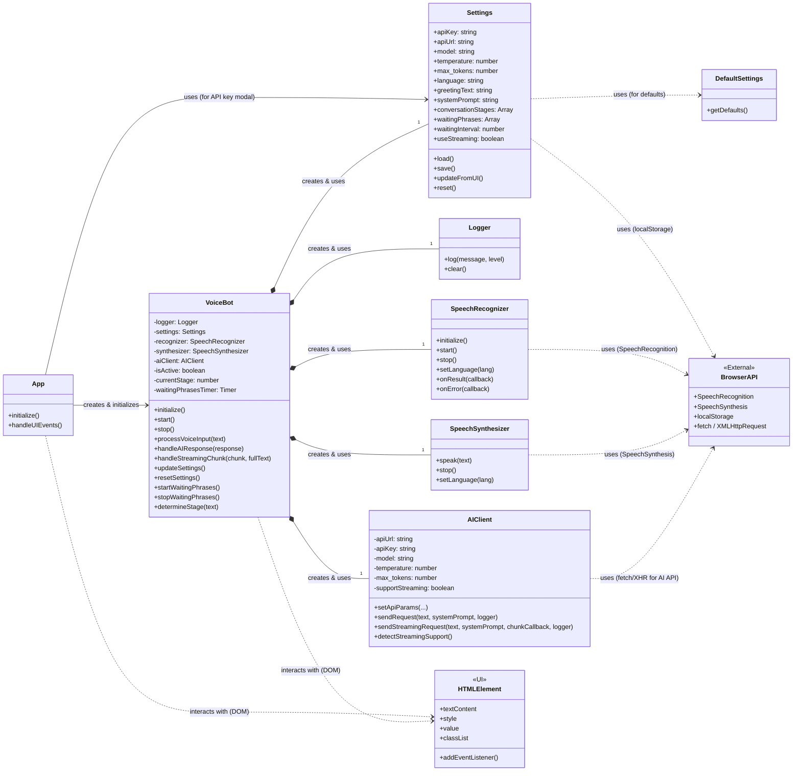

# Voice Bot Interaction Diagram

This diagram illustrates the relationships and interactions between the main components of the Voice Bot application.



## Interaction Sequence Diagram

This diagram shows the typical sequence of events when a user interacts with the Voice Bot.

```mermaid
sequenceDiagram
    participant User
    participant App (UI)
    participant VoiceBot
    participant SpeechRecognizer
    participant AIClient
    participant SpeechSynthesizer
    participant Logger
    participant Settings

    User->>App (UI): Interacts (e.g., clicks Start)
    App (UI)->>VoiceBot: start()
    VoiceBot->>Settings: load()
    VoiceBot->>SpeechRecognizer: initialize()
    VoiceBot->>SpeechSynthesizer: initialize()
    VoiceBot->>AIClient: setApiParams(...)
    VoiceBot->>Logger: log("Bot started")
    VoiceBot->>SpeechRecognizer: start()
    activate SpeechRecognizer
    User->>SpeechRecognizer: Speaks
    SpeechRecognizer->>VoiceBot: onResult(text)
    deactivate SpeechRecognizer
    VoiceBot->>Logger: log("Recognized: " + text)
    VoiceBot->>AIClient: sendRequest(text, systemPrompt, logger) / sendStreamingRequest(...)
    activate AIClient
    AIClient->>External AI API: Request
    External AI API-->>AIClient: Response / Stream Chunks
    AIClient-->>VoiceBot: handleAIResponse(response) / handleStreamingChunk(chunk, fullText)
    deactivate AIClient
    VoiceBot->>Logger: log("AI Response: " + response)
    VoiceBot->>SpeechSynthesizer: speak(response)
    activate SpeechSynthesizer
    SpeechSynthesizer->>User: Speaks response
    deactivate SpeechSynthesizer
    VoiceBot->>App (UI): Updates UI (e.g., display text)
    VoiceBot->>SpeechRecognizer: start() # Listen for next input
